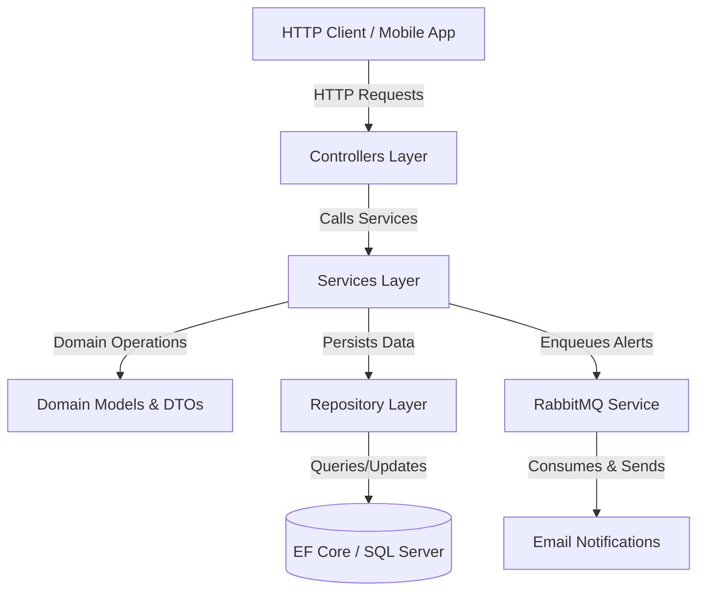

# PicPay.NET - Backend System Documentation

PicPay.NET is a simplified backend transaction service implementation of the PicPay simplified backend challenge. The application is built on top of **.NET 9.0 (ASP.NET Core)** and utilizes **Entity Framework Core 9.0**, **SQL Server**, and **RabbitMQ** for processing asynchronous notification delivery.

---

## 1. System Architecture

The project follows a modular layered architecture, facilitating clean separation of concerns:



### Layer Descriptions

*   **Controllers**: Exposes RESTful HTTP endpoints for managing Users, Wallets, and Transactions.
*   **Services**: Contains the core business logic, orchestrating transaction flows, wallet updates, and messaging integration.
*   **Domains**: Defines rich domain models, validation constraints, and DTOs (Data Transfer Objects).
*   **Repository**: Handles data persistence using the Repository Pattern with EF Core DbContext.
*   **Infra**: Docker and Terraform configurations for database deployment and AWS provisioning.
*   **Filters**: Custom validation middleware (e.g., validating avatar image uploads).

---

## 2. Domain Model & Business Rules

### Core Entities

1.  **Usuario**: Represents the account owner, either a standard customer (`USUARIO`) or a merchant (`LOJISTA`).
2.  **Carteira**: Represents the digital wallet containing the balance associated with a specific user.
3.  **Transacao**: Tracks successful transactions between wallet IDs.

### Key Business Constraints

> [!IMPORTANT]
> - **Standard User (`USUARIO`)**: Can both send and receive money.
> - **Merchant (`LOJISTA`)**: Can **only receive** transfers; they are forbidden from initiating standard transfers (acting as a Payer).
> - **Balance Check**: Any transfer must first verify that the Payer has sufficient funds.
> - **Transaction Atomicity**: In case of failure during the transfer process or saving to the database, a complete rollback is triggered to preserve data consistency.

---

## 3. API Reference

All requests and responses use the `application/json` format unless specified otherwise.

### Users (Usuario)

| HTTP Method | Route | Description | Input / DTO | Response Status |
| :--- | :--- | :--- | :--- | :--- |
| **POST** | `/Usuario` | Register a new user (Customer or Merchant) | `UsuarioDTO` | `201 Created` |
| **GET** | `/Usuario/{id}` | Retrieve details of a user by UUID | *None* | `200 OK`, `404 Not Found` |
| **DELETE** | `/Usuario` | Delete a user by UUID (passed in query parameter) | `?id={id}` | `200 OK` |
| **POST** | `/Usuario/{id}/imagem` | Upload or update user avatar image | Multipart Form Data | `201 Created`, `400 Bad Request` |

### Wallets (Carteira)

| HTTP Method | Route | Description | Input | Response Status |
| :--- | :--- | :--- | :--- | :--- |
| **POST** | `/Carteira/{UserId}` | Create a wallet for an existing user | URL Path Parameter | `201 Created` |
| **GET** | `/Carteira/{id}` | Retrieve wallet by wallet ID | *None* | `200 OK`, `404 Not Found` |
| **GET** | `/Carteira/user/{userId}`| Retrieve wallet by owner's user ID | *None* | `200 OK`, `404 Not Found` |
| **DELETE** | `/Carteira/{id}` | Delete a wallet by ID | *None* | `200 OK` |

### Transactions (Transacao)

| HTTP Method | Route | Description | Input / DTO | Response Status |
| :--- | :--- | :--- | :--- | :--- |
| **POST** | `/Transacao` | Execute transfer between standard user and merchant/user | `TransacaoDTO` | `201 Created` |
| **GET** | `/Transacao/{id}` | Retrieve transaction by UUID | *None* | `200 OK`, `404 Not Found` |
| **GET** | `/Transacao/payer/{id}` | Retrieve list of transactions sent by a Payer ID | *None* | `200 OK` |
| **GET** | `/Transacao/payee/{id}` | Retrieve list of transactions received by a Payee ID | *None* | `200 OK` |
| **GET** | `/Transacao/any/{id}` | Retrieve transactions where the ID is Payer OR Payee | *None* | `200 OK` |

---

## 4. Transaction Processing Flow

When a transaction request hits `TransacaoController`, the processing logic is delegated to `TransacaoService`:

```csharp
public async Task<TransacaoDTO> Processar(TransacaoDTO transacaoDTO)
{
    var carteiraPayer = await _carteiraRepository.FindByIdWithUserAsync(transacaoDTO.CarteiraPayerId) ?? throw new KeyNotFoundException();
    var carteiraPayee = await _carteiraRepository.FindByIdWithUserAsync(transacaoDTO.CarteiraPayeeId) ?? throw new KeyNotFoundException();

    var UsuarioPayer = carteiraPayer.Usuario ?? throw new KeyNotFoundException();
    var UsuarioPayee = carteiraPayee.Usuario ?? throw new KeyNotFoundException();

    // 1. Validation Check
    if (UsuarioPayer.IsLojista())
    {
        throw new BusinessException("Pagador não pode ser Lojista");
    }

    // 2. Database Transaction Isolation
    using var transaction = await _DataBase.Database.BeginTransactionAsync();
    try
    {
        // 3. Debit & Credit Wallet balance updates
        carteiraPayer.Debitar(transacaoDTO.Valor);
        carteiraPayee.Creditar(transacaoDTO.Valor);

        // 4. Save transaction log
        var entity = await _transacaoRepository.Create(new Transacao(transacaoDTO.Valor, carteiraPayer.Id, carteiraPayee.Id));
        await _DataBase.SaveChangesAsync();

        await transaction.CommitAsync();

        transacaoDTO.Id = entity.Id;

        // 5. Asynchronous notification publishing via RabbitMQ
        await _notificationSender.PublishEmail(new EmailDTO
        {
            PayerNome = UsuarioPayer.Nome,
            PayeeNome = UsuarioPayee.Nome,
            PayerEmail = UsuarioPayer.Email,
            PayeeEmail = UsuarioPayee.Email,
            TransactionValue = transacaoDTO.Valor
        });

        return transacaoDTO;
    }
    catch (Exception)
    {
        await transaction.RollbackAsync();
        throw;
    }
}
```

---

## 5. Infrastructure & Deployment (DevOps)

The service can be run locally or provisioned in the cloud:

### Local Database Container
A pre-configured MS SQL Server Docker container is available. The database configuration is described inside the root `docker-compose.yml`:

```yaml
services:
  sqlserver:
    image: mcr.microsoft.com/mssql/server:2022-latest
    container_name: sql_container
    environment:
      ACCEPT_EULA: "Y"
      MSSQL_SA_PASSWORD: "PicPay_SqlPass2026!"
      MSSQL_PID: "Developer"
    ports:
      - "1433:1433"
    volumes:
      - mssql_data:/var/opt/mssql
```

### AWS Cloud Deployment (Terraform)
Cloud architecture is set up in the `Infra` folder:
- `main.tf`: Provisions an AWS EC2 instance, configures ingress security groups for HTTP (Port 80) and SSH (Port 22), sets up key-pairs, and copies target startup scripts to the host.
- `user_data.sh`: Automates updates and installs Docker & Docker-Compose on Amazon Linux.
- `start.sh`: Starts SQL Server database, fetches the production environment variables, and launches the ASP.NET application container `danielkappa/picpay`.

---

## 6. Test Suite Overview
Quality assurance is handled through unit tests structured under `PicPay.Tests`:
- `CarteiraTests.cs`: Validates basic wallet functionality (e.g., successful balance updates, negative values detection, and throwing `BusinessException` for overdrafts).
- `CarteiraServiceTests.cs`: Verifies orchestration logic when fetching and deleting wallets.
- `TransacaoServiceTests.cs`: Simulates transactional rules (ensuring merchant prevention, database commits, rollbacks, and RabbitMQ message sending).
- `UsuarioServiceTests.cs` & `UsuarioTests.cs`: Ensures name validation constraints, password length checks, and image formatting constraints work correctly.
